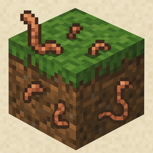

# TerraVermis

*Worms that bring the soil to life.*

**TerraVermis** adds earthworms to Minecraft—tiny but powerful creatures that improve soil fertility, speed up composting, and enhance fishing.

---

## Main Features

### **Natural Spawning**
- Break **dirt, podzol, rooted dirt, mycelium**, and more to find earthworms.
- **Rain and Fortune enchantments increase drop chance**.
- Worms can also emerge from **composters** or appear naturally in **moist soil**.

### **What Can You Do With Worms?**
- **Desperate Snack**: Worms can be eaten when starving, restoring **0.5 hunger** (1 food point). Not tasty, but better than dying...
- **Soil Enrichment**: Use worms to craft **fertile soil** that boosts crop growth.
- **Fishing Bait**: Speeds up catch time and improves loot.
- **Compost Boost**: Throw worms into composters to accelerate composting.
- **Natural Fertilizer**: Convert them into a **special fertilizer**—more effective than bonemeal.

### **Environmental Integration**
- Worms **die in polluted or unnatural blocks** (for modded environments).
- Their presence can be **visualized** via particles or **crawling entities**.
- Combine with **vermicomposters** (if enabled) for passive fertilizer generation.

---

## Configuration

All mechanics—drop rates, compost behavior, growth boosts—are **configurable** via JSON or `common.toml`.

---

## Source & Contributions

- [GitHub](https://github.com/Daniel-Mendes/TerraVermis)
- Contributions welcome: translations, textures, feature ideas.

---

## Credits

- Developer: **Daniel-Mendes**
- Textures & art: **[add credits or tools used]**
- Inspired by real vermiculture and eco-farming concepts.

---

**Make Minecraft greener, one worm at a time.**
